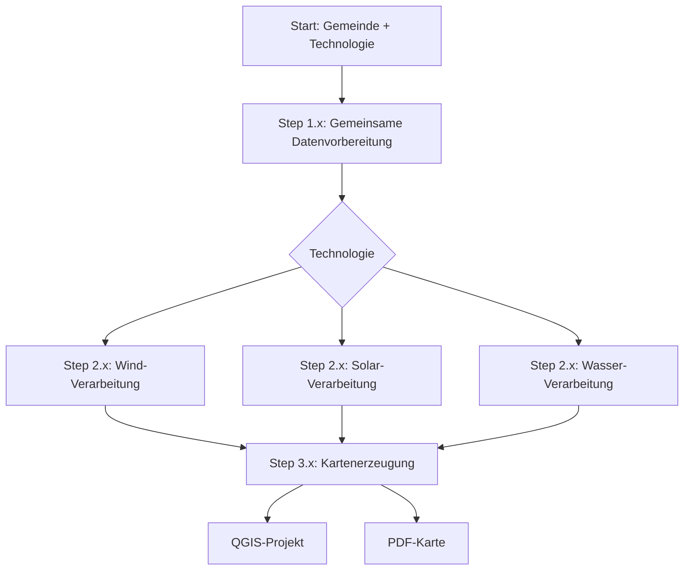
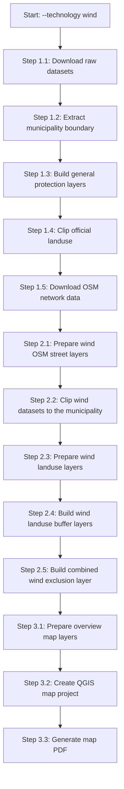
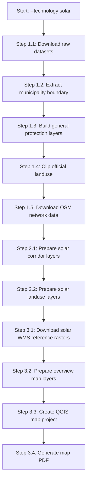
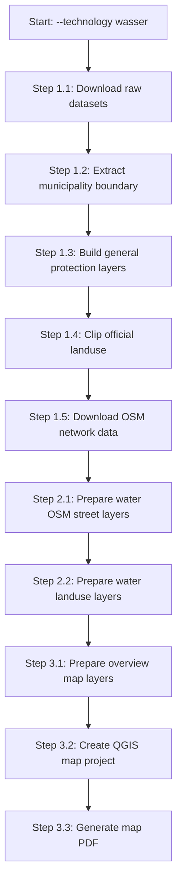

# Workflow-Diagramme

Diese Datei sammelt die aktuellen Workflow-Diagramme der Pipeline. Die
Bezeichnungen entsprechen den Log-Ausgaben der Einstiegsskripte. Dadurch kann
man später direkt von der Konsole zur Dokumentation wechseln.

## 1. Nummerierungslogik

Die Pipeline ist in drei Blöcke gegliedert:

| Block | Bedeutung | Beispiel |
| --- | --- | --- |
| `Step 1.x` | gemeinsame Datenvorbereitung | Gemeindegrenze, Schutzgebiete, Landnutzung, OSM-Rohdaten |
| `Step 2.x` | technologiespezifische Verarbeitung | Wind-, Solar- oder Wasser-Layer |
| `Step 3.x` | Kartenerzeugung | Übersichtskarte, QGIS-Projekt und PDF |

So bleibt die Nummerierung stabil, auch wenn Wind, Solar und Wasser später
unterschiedlich viele Einzelschritte haben.

## 2. Allgemeiner Pipeline-Ablauf

## 3. Wind-Workflow als Mermaid-Diagramm

Der Wind-Workflow ist aktuell der wichtigste vollständig ausgearbeitete
Workflow. Er nutzt amtliche Windplanungsdaten, allgemeine Naturschutz-Layer,
Landnutzung, OSM-Straßen sowie einen kombinierten Ausschlusslayer.

## 4. Wind-Workflow als Textablauf

Dieser Abschnitt ist bewusst nicht parallel geschrieben. Die Skripte werden
nacheinander ausgeführt.

### Step 1.x: Gemeinsame Datenvorbereitung

1. `Step 1.1: Download raw datasets`
   - Skript: `scripts/1_prepare_data/1_download_data.py`
   - Aufgabe: Rohdaten herunterladen oder vorhandene Downloads wiederverwenden.

2. `Step 1.2: Extract municipality boundary`
   - Skript: `scripts/1_prepare_data/2_extract_municipality_boundary.py`
   - Aufgabe: Gemeindegrenze aus dem amtlichen Verwaltungsdatensatz extrahieren.

3. `Step 1.3: Build general protection layers`
   - Skript: `scripts/1_prepare_data/3_build_protection_layers.py`
   - Aufgabe: harte, weiche und windspezifische Naturschutz-Layer erzeugen.

4. `Step 1.4: Clip official landuse`
   - Skript: `scripts/1_prepare_data/4_clip_landuse.py`
   - Aufgabe: amtliche Landnutzung auf die Gemeinde zuschneiden.

5. `Step 1.5: Download OSM network data`
   - Skript: `scripts/1_prepare_data/5_download_osm_network_data.py`
   - Aufgabe: OSM-Netzwerkdaten für den erweiterten Analysekontext laden.

### Step 2.x: Wind-spezifische Verarbeitung

1. `Step 2.1: Prepare wind OSM street layers`
   - Skript: `scripts/2_1_wind/4_prepare_wind_osm_streets.py`
   - Aufgabe: OSM-Straßen für den Wind-Workflow filtern und vorbereiten.

2. `Step 2.2: Clip wind datasets to the municipality`
   - Skript: `scripts/2_1_wind/1_clip_wind_planning_areas.py`
   - Aufgabe: Wind-Vorrang- und Vorbehaltsgebiete auf die Gemeinde clippen.

3. `Step 2.3: Prepare wind landuse layers`
   - Skript: `scripts/2_1_wind/2_prepare_wind_landuse.py`
   - Aufgabe: Landnutzung in Ausschluss, Potenzial, geeignet und unused einteilen.

4. `Step 2.4: Build wind landuse buffer layers`
   - Skript: `scripts/2_1_wind/3_build_wind_landuse_buffers.py`
   - Aufgabe: definierte Puffer für windrelevante Landnutzungsklassen erzeugen.

5. `Step 2.5: Build combined wind exclusion layer`
   - Skript: `scripts/2_1_wind/5_build_wind_exclusion_layer.py`
   - Aufgabe: Landnutzungs- und OSM-Ausschlussflächen zu einem Gesamtlayer
     kombinieren.

### Step 3.x: Kartenerzeugung

1. `Step 3.1: Prepare overview map layers`
   - Skript: `scripts/3_generate_map/1_prepare_overview_layers.py`
   - Aufgabe: Bayern-Außenumriss und gemeindespezifische Locator-Layer für
     die kleine Übersichtskarte erzeugen.

2. `Step 3.2: Create QGIS map project`
   - Skript: `scripts/3_generate_map/2_create_map_qgis_project.py`
   - Aufgabe: QGIS-Projekt mit sichtbaren Kartenlayern und ausgeblendeten
     Detail- und Attributlayern erzeugen.

3. `Step 3.3: Generate map PDF`
   - Skript: `scripts/3_generate_map/3_generate_map_pdf.py`
   - Aufgabe: PDF-Karte aus dem QGIS-Projekt exportieren und vorbereitete
     Übersichtskarten-Layer einbinden.

## 5. Solar-Workflow als Kurzdiagramm

Der Solar-Workflow ist strukturell vorbereitet. Die fachliche Prüfung und
Kartendarstellung werden noch weiter verfeinert.

## 6. Wasser-Workflow als Kurzdiagramm

Der Wasser-Workflow ist technisch vorbereitet, aber fachlich noch nicht final.

